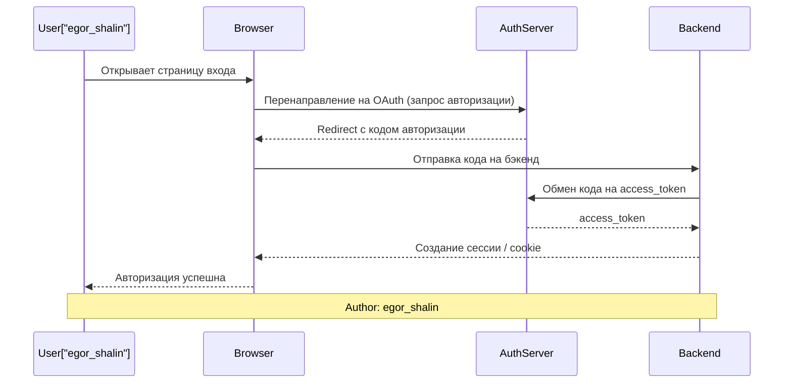

# Chat log — Diagram 1 (Sequence)

**Prompt:**

```
Представь, что ты системный архитектор. Напиши код для Mermaid sequence диаграммы, которая описывает процесс авторизации пользователя через OAuth (клиент → браузер → авторизационный сервер → бэкенд). Обязательно добавь на схему блок или подпись 'Author: egor_shalin'.
```

**LLM response (пример):**



Скопируйте блок кода из ответа в `artifacts/diagram_1_code.md` и вставьте в Mermaid Live Editor для экспорта PNG.
