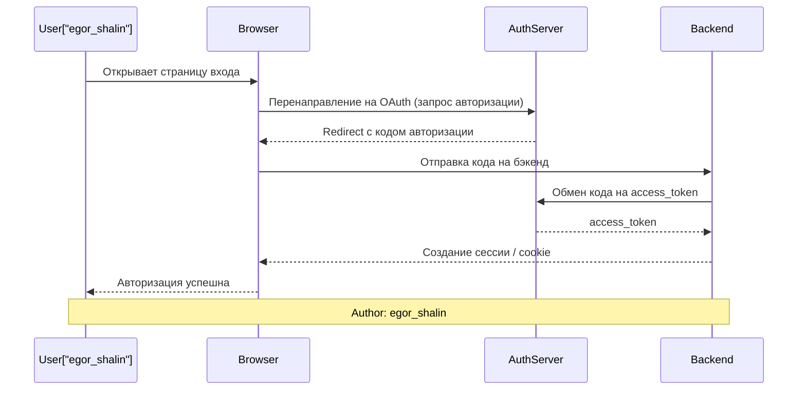

```mermaid
sequenceDiagram
    participant User as User["egor_shalin"]
    participant Browser as Browser
    participant Auth as AuthServer
    participant Backend as Backend

    User->>Browser: Открывает страницу входа
    Browser->>Auth: Перенаправление на OAuth (запрос авторизации)
    Auth-->>Browser: Redirect с кодом авторизации
    Browser->>Backend: Отправка кода на бэкенд
    Backend->>Auth: Обмен кода на access_token
    Auth-->>Backend: access_token
    Backend-->>Browser: Создание сессии / cookie
    Browser-->>User: Авторизация успешна

    Note over User,Backend: Author: egor_shalin
```
