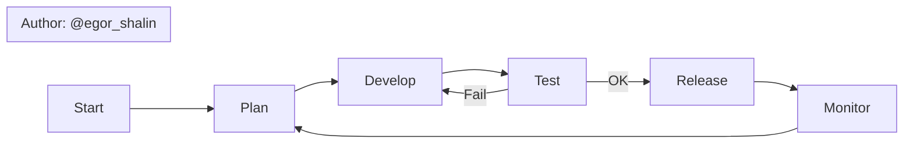

# Chat log — Diagram 2 (Flowchart)

**Prompt:**

```
Представь, что ты системный архитектор. Напиши код для Mermaid flowchart, описывающий рабочий процесс разработки: планирование → реализация → тестирование → релиз. Обязательно добавь подпись 'Author: egor_shalin' в подпорог или subgraph.
```

**LLM response (пример):**



Скопируйте код в `artifacts/diagram_2_code.md` и экспортируйте PNG.
