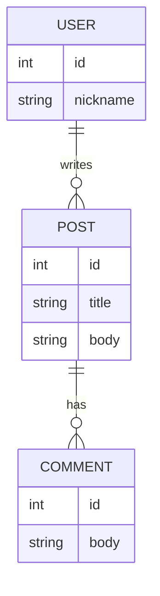

# Chat log — Diagram 3 (ER diagram)

**Prompt:**

```
Представь, что ты системный архитектор. Напиши код для Mermaid ER-диаграммы, описывающей простую блоговую модель (Users, Posts, Comments). Убедись, что на схеме явно указан никнейм 'egor_shalin' (например, как значение поля или как заметка).
```

**LLM response (пример):**



Скопируйте код в `artifacts/diagram_3_code.md` и экспортируйте PNG.
