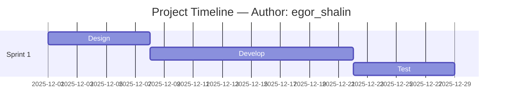

# Chat log — Diagram 5 (Gantt)

**Prompt:**

```
Представь, что ты системный архитектор/проектный менеджер. Напиши код для Mermaid Gantt диаграммы, описывающей простой 3-недельный план: дизайн, разработка, тестирование. В заголовке укажи 'Author: egor_shalin'.
```

**LLM response (пример):**



Скопируйте код в `artifacts/diagram_5_code.md` и экспортируйте PNG.
